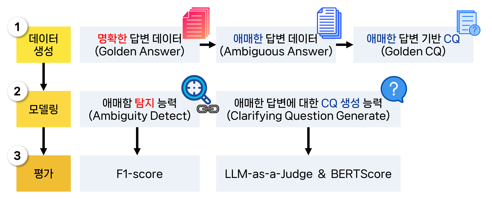
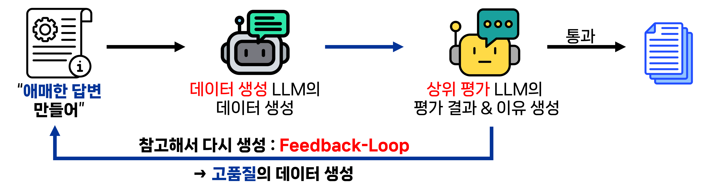
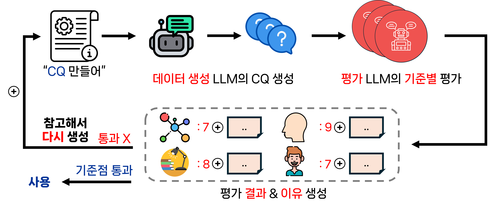
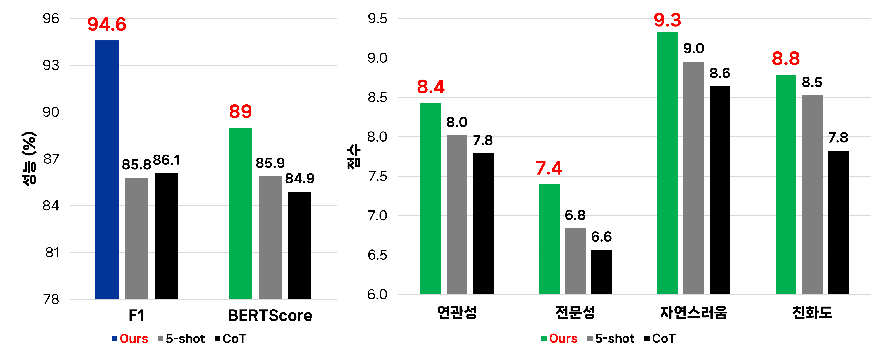
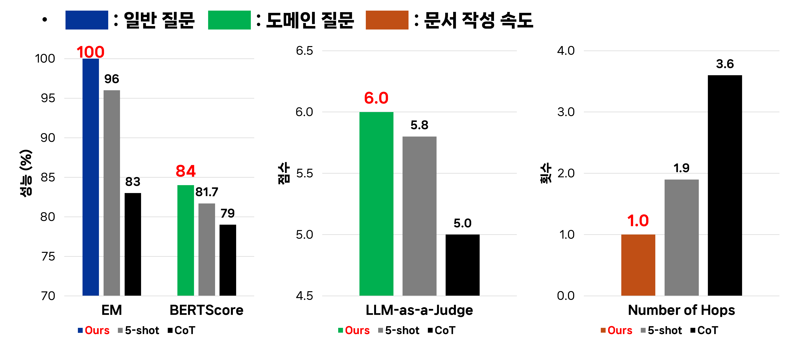
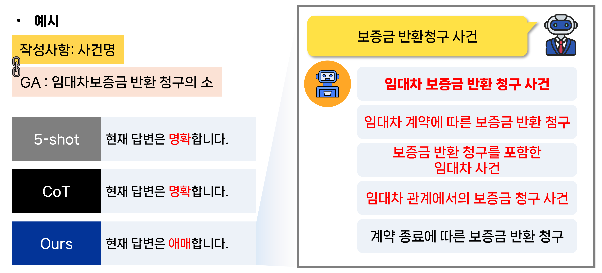

# LLM-based Domain Document Generation Chatbot<br>
(ClarifyDocs: 사용자 응답 명확화를 통한 도메인 문서 자동 작성)

- 협업 기업: Markr.AI

- 한양대학교 첨단제조산학협력프로젝트경진대회 3rd place 🥉 (한양대학교 총장상)

## Period
25.03.02 ~ 25.12.19

## File Structure
```
.
├── scripts/
│   ├── prompt_templates.yaml      # Task-specific prompt templates
│   └── run_main.sh                # Run main pipeline with configurable hyperparameters
│
├── src/
│   ├── main.py                    # Entry point that orchestrates and runs each module
│   ├── data_split.py              # Train/Validation/Test split logic
│   ├── generate_AA.py             # Ambiguous Answer (AA) data generation
│   ├── generate_CQ.py             # Clarifying Question (CQ) data generation
│   ├── hf_dataset_io.py           # Push/Pull datasets to and from Hugging Face Hub
│   ├── my_parser.py               # Argument and configuration parser
│   └── simulation.py              # Document writing simulation pipeline
├── data/                          # Dataset files
└── README.md
```

## Overview
- 민사 소장 작성 과정에서 모호한 사용자 입력을 적절히 처리하지 못하는 기존 LLM 기반 챗봇의 한계를, 모호성 인지 기반 질의(clarification) 메커니즘을 도입하여 개선하였다.

- Feedback-loop 기반 데이터 생성 파이프라인을 구축하여 고품질의 모호 응답(Ambiguous Answer)과 명확화 질문(Clarifying Question) 생성 후, GPT-4o-mini supervised fine-tuning
- 기존 prompt engineering 방식 대비 Macro-F1 94.57%(+8.8%p), **BERTScore 89%(+4.07%p)** 달성했다.


## Background
현대 사회에서 법률 및 행정 문서는 필수적이지만, 일반 시민들에게는 여전히 작성이 어렵다. 많은 사용자들이 복잡한 작성 요건을 이해하지 못해 어려움을 겪고, 반복적인 수정 요청을 받으며 문서를 여러 차례 다시 작성하게 된다.

ChatGPT와 같은 LLM은 문서 작성에 도움을 줄 수 있지만 여전히 한계도 존재한다. 사용자의 애매한 응답을 적절히 처리하지 못하고, 법률 문서에서 부정확한 내용을 생성할 수 있으며, 체계적인 구체화(clarification) 메커니즘이 부족하다.

특히 민사소송과 같은 법률 도메인에서는 사용자가 전문 지식 부족으로 인해 애매한 답변을 제공하는 경우가 빈번하다.

이에 따라 우리는 사용자의 응답에서 애매함을 감지하고, 정확한 정보를 수집하기 위해 Clarifying Question(CQ)을 생성하는 챗봇을 제안한다.


## Problem Definition

  - 도메인 특화 문서 작성 과정에서 발생하는 사용자의 애매한 응답을 처리할 수 있는 챗봇 개발에 초점을 맞춘다.
 
  - 본 프로젝트는 다음과 같은 세 단계로 구성된다.

### 1. Synthetic Data Construction

 - Ambiguous Answer(AA) 생성
   
 - 이에 대응하는 Clarifying Question(CQ) 생성

### 2. Modeling
   
  - 합성 데이터셋을 활용한 Supervised Fine-Tuning(SFT) 수행
    
  - Baselines 기법과의 성능 비교
    
### 3. Document-writing Simulation
   
  - 문서 완성 속도 평가
    
  - 정확도 및 구체화(clarification) 품질 측정

이 과정을 통해 우리는 애매한 입력을 효과적으로 구체화하고, 복잡한 도메인 문서를 정확하게 완성할 수 있는 챗봇을 개발하고자 한다.



## Method

### 1. Synthetic Data Construction (AA, CQ)

  - 본 연구에서는 도메인 문서 작성 과정에서 발생하는 **사용자 응답의 애매함(Ambiguity)** 을 모델링하기 위해 합성 데이터셋을 구축하였다.

  - 실험 도메인으로는 민사소송 소장을 선정하였다. 소장은 다음과 같은 두 유형의 질문으로 구성된다.

    - 일반 질문 (예: 주소, 전화번호 등)

    - 도메인 질문 (예: 사건명, 청구 구분, 인격 구분 등)

  - 특히 도메인 질문의 경우, 법률 지식이 부족한 사용자는 애매한 표현으로 응답할 가능성이 높다. 이를 모델링하기 위해 다음 데이터를 구축하였다.

#### (1) Golden Answer (GA)

  - 각 도메인 질문에 대해 명확하고 정답에 해당하는 Golden Answer를 정의하였다.

  ```
  예시
  Q: 사건명을 작성해주세요
  A: 채권양도금
  ```
  
#### (2) Ambiguous Answer (AA)
  
  - 비전문가 사용자의 응답을 모사하기 위해 LLM을 활용하여 **애매한 답변(Ambiguous Answer)** 을 생성하였다.
    
  - 데이터 품질을 확보하기 위해 Feedback-Loop 기반 생성 파이프라인을 설계하였다.

  - 데이터 생성 LLM이 애매한 답변 생성 > 평가 LLM이 품질 및 적절성 평가 > 미흡한 경우 피드백을 반영하여 재생성

  - 이 과정을 반복함으로써 높은 품질의 애매한 응답 데이터를 구축하였다.

  ```
  예시
  Q: 사건명을 작성해주세요
  A: 돈을 다른 사람에게 넘기는 그런 경우
  ```

  
  


#### (3) Golden Clarifying Question (CQ)

  - 애매한 답변이 주어졌을 때 이를 구체화할 수 있는 **Golden Clarifying Question(CQ)** 을 생성하였다.
  - CQ 데이터 또한 동일한 Feedback-Loop 과정을 통해 생성하였다.

  ```
  예시
  Ambiguous Answer: 돈을 다른 사람에게 넘기는 그런 경우
  Golden CQ: 혹시 ‘채권양도금’을 말씀하시는 건가요?
  ```
    
  

### 2. Modeling

#### Training
  - Dataset : Train : Validation : Test = 1,176 : 196 : 196
  - 학습 방식 : Supervised Fine-Tuning (SFT)
  - 학습 모델 : gpt-4o-mini
  - Input : 질문 + 사용자 답변
  - Ouput : Ambiguity Classification + (답변이 애매할 경우) CQ 생성

#### Baselines
  - 5-shot : 5개의 예시를 참고하여 문제를 푸는 Prompt Engineering 기법
  - CoT : 단계별 추론으로 문제를 풀어 더 논리적인 답변을 생성하는 Prompt Engineering 기법

#### Evaluation 
  - F1-score : 사용자의 답변이 애매한지 정확히 분류하는지 평가
  - BERTScore : Golden CQ와의 문맥적 유사도 평가
  - LLM-as-Judge : 연관성(Relevance), 전문성(Knowledgeable), 자연스러움(Naturalness), 친화도(Engagingness) 평가 (1~10점)

    

### 3. Document-writing Simulation
모델의 실제 서비스 적용 가능성을 검증하기 위해, 실제 사용자의 애매한 답변을 기반으로 한 문서 작성 시뮬레이션을 수행하였다.

#### Experimental Setup

  - 대상: 한양대학교 학부생 11명

  - 평균 법률 지식 수준: 3.1 / 10

#### Simulation Process

  1. Chatbot이 문서 항목 질문

  2. Agent가 학생의 실제 답변을 그대로 입력

  3. 모델이 답변의 애매함 여부 판단

  4. 애매한 경우: 구체화된 선택지 5개 생성

  5. Agent는 Golden Answer 기준으로 가장 적절한 선택지 선택

  6. 적절한 선택지가 없을 경우: “없음” 선택 -> 모델이 새로운 선택지 5개 재생성

#### Evaluation
  - Exact Match (EM) : 사용자의 명확한 답변을 그대로 정확히 반영했는지 평가 (일반 질문 정확도)
  - BERTScore & LLM-as-Judge (1~10점 평가) : Golden Answer 대비 문맥적 유사도 및 전문성 평가 (도메인 질문 구체화 품질)
  - Number of Hops : 문서 완성까지 필요한 대화 횟수 (문서 작성 효율성)
  
  

  

## Conclusion
  - 본 프로젝트는 사용자의 애매한 응답을 정확히 구체화하는 도메인 문서 작성 Chatbot을 제안하였다.
  - LLM 기반 데이터 생성과 Self-Improvement 학습 구조를 통해 애매함 탐지 및 Clarifying Question 생성 성능을 효과적으로 향상시켰다.
  - 실험 및 실제 사용자 시뮬레이션 결과, 기존 방식 대비 더 정확하고 빠르게 문서를 완성할 수 있음을 확인하였다.
  - 본 접근 방식은 향후 행정·법률 문서 자동화 등 다양한 도메인으로 확장 가능하다.
